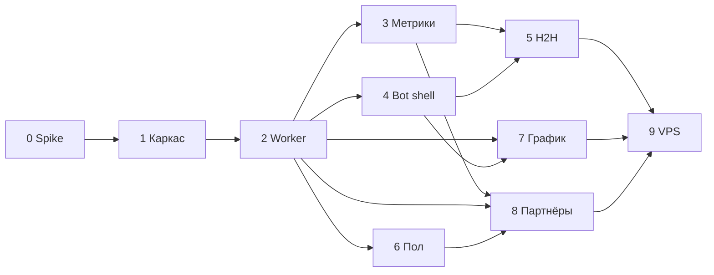

# План реализации

> Этапы, зависимости и критерии готовности.  
> Актуально на основе [`BRIEF.md`](BRIEF.md). Целевая аудитория — **парные игроки**.  
> **Этап 0 завершён** — отчёт spike: [`spike-parser.md`](spike-parser.md).

## Принятые допущения для плана

| Тема | Решение |
|---|---|
| Аудитория / MVP | Парные дисциплины: **D, MD, WD, XD**; одиночка — вторично |
| Репозиторий | Maven **multi-module**: `core`, `worker`, `bot` |
| Парсер | Многопоточность, пул **8–16** потоков, **≤10 req/s** на хост, retry |
| Бот | **Публичный**, без доп. авторизации |
| Деплой | **Docker Compose локально** → VPS позже |
| Telegram | **Long polling** |
| Тесты | **HTML-fixtures** в `test/resources` с первого этапа |
| Подбор партнёров | **Этап 8** (после стабильного парного H2H и пола игрока) |

---

## Обзор этапов

```
[0 Spike ✓] → [1 Каркас ✓] → [2 Worker слепок ✓] → [3 Метрики ✓] → [4 Bot shell ✓]
    → [5 H2H пары] → [6 Пол игрока] → [7 График рейтинга] → [8 Партнёры] → [9 VPS деплой]
                                                                              → [10+ Roadmap]
```

---

## Этап 0 — Spike парсера (парные данные) ✓

**Статус:** завершён (2026-07-21). Отчёт и выводы: **[`spike-parser.md`](spike-parser.md)**.

**Цель:** подтвердить, что с badminton4u.ru можно стабильно получить данные для парных игроков.

**Задачи (выполнено):**
- HTML-fixtures: список турниров, будущий/прошедший парный турнир, профиль игрока, `gamesd` турнира.
- Прототип парсеров в `worker`: пары, pair-vs-pair, `external_key` матчей, агрегатор соперников.
- Зафиксировано: регистрация SSR/AJAX; `/rivals` отвергнут — соперники из `gamesd`.

**Итог spike (кратко):**
- Pair-vs-pair **GO** через `gamesd/?tourID=` (SSR, 4 игрока на матч).
- Регистрация: SSR в `#tour-reg-list1` **или** AJAX (`POST /?ajax`) — worker поддержит оба варианта.
- Модуль `worker`, Java **17** (spike), **5** fixtures, 5 парсеров + агрегатор, unit-тесты green.
- Эталоны: игрок [18499](https://badminton4u.ru/players/18499), турниры [12713](https://badminton4u.ru/tournaments/12713) / [12834](https://badminton4u.ru/tournaments/12834).

**DoD:**
- [x] Отчёт в [`docs/spike-parser.md`](spike-parser.md): go/no-go по pair-vs-pair.
- [x] ≥5 fixtures в `worker/src/test/resources/html/` (фактически **5**).
- [x] Парсер проходит unit-тесты на fixtures для: турнир, пара в регистрации, итоговая строка пары.

**Оценка:** 2–4 дня.

---

## Этап 1 — Каркас проекта ✓

**Статус:** завершён (2026-07-21).

**Цель:** собираемый multi-module проект + локальная инфраструктура.

**Задачи (выполнено):**
- Maven parent + модули:
  - **`core`** — JPA-сущности, репозитории, Flyway-миграции (из [`schema.sql`](schema.sql)), конфиг-параметры метрик.
  - **`worker`** — зависит от `core`, Spring Boot без web (actuator).
  - **`bot`** — зависит от `core`, Spring Boot + Telegram long polling.
- `docker-compose.yml`: PostgreSQL (+ pg_trgm), порт **5433** (обход локального Postgres на 5432).
- Flyway V1: перенос `schema.sql` в `core/src/main/resources/db/migration/`.
- `.env.example`: `BOT_TOKEN`, `DB_*`, параметры парсера (`PARSER_THREADS`, `PARSER_MAX_RPS`).
- **`dev.ps1` / `dev.cmd`** — короткие команды запуска/остановки компонентов (см. [`README.md`](README.md)).

**DoD:**
- [x] `./mvnw clean verify` проходит.
- [x] `docker compose up -d postgres` + приложение подключается к БД, миграции накатываются.
- [x] Bot отвечает на `/start` (заглушка).

**Оценка:** 3–5 дней.

---

## Этап 2 — Worker: полный слепок региона ✓ (реализация)

**Цель:** ежедневный слепок Москва/МО за 3 года в PostgreSQL.

**Статус:** реализовано и проверено дымовым прогоном (см. ниже). Полный 3-летний слепок
r77 запускается пользователем (heavy live-scrape).

**Задачи (выполнено):**
- HTTP-слой: `RateLimiter` (глобальный ≤ maxRps), `HttpFetcher` (jsoup, UA, retry+backoff, 404 без ретрая),
  `Badminton4uClient` (URL: список призёров по типу, страница турнира, `gamesd`, профиль).
- Pipeline (многопоточный, rate-limited) в `worker.snapshot`:
  1. Завершённые турниры `r77` **раздельными запросами по типам** (`types[]=d/md/wd/xd`) → дисциплина из фильтра.
  2. Страница турнира → `TournamentResultsParser` → `Participation`, `Pair` (пары через `PairService`, идемпотентно).
  3. `gamesd/?tourID=` → `Match`, `match_player` (идемпотентность по `source+external_key`).
  4. Профили игроков (dedup) → `Player`, `player_rating`, `player_rating_history` (по всем дисциплинам).
  5. `rival_summary` (вариант C) — **полная пересборка** из БД (`RivalSummaryRebuildService`), идемпотентно.
- Идемпотентность: upsert по external ID; `snapshot_meta.last_sync_at` + окно.
- Spring `@Scheduled` (флаг `scheduled-enabled`, cron) + ручной dev-trigger (`run-on-startup`, синхронно).
- **Точечный re-import** по списку ID (`SNAPSHOT_TOURNAMENT_IDS`) — без полного обхода списка турниров.
- Метрики прогона (`SnapshotMetrics`): турниры/игроки/матчи/rival/ошибки/длительность (в лог).
- Регистрация будущих турниров (`TournamentRegistration`, SSR/AJAX) **отложена в этап 8**.

**DoD:**
- [x] Слепок r77 завершается локально. Дымовой прогон (1 дисциплина WD, лимит 3 турнира, ≤5 req/s):
  ~9 c, 32 игрока, 41 матч, 272 строки `rival_summary`, 0 ошибок. Полный 3-летний — за пользователем.
- [x] Повторный слепок идемпотентен: 2-й прогон — 0 новых матчей, 0 ошибок, `rival_summary` стабилен.
- [x] Unit-тесты парсеров на fixtures (green) + unit-тесты мапперов (`SnapshotSupportTest`).
  Testcontainers-интеграция отложена (проверка идемпотентности — вручную на локальной БД).

**Оценка:** 1–2 недели (зависит от spike).

---

## Этап 3 — Метрики (core) ✓ (реализация)

**Цель:** воспроизводимые расчёты S, Form, P3, рейтинг пары.

**Статус:** реализовано (2026-07-22). Чистые расчётные сервисы в пакете `core.metrics`,
21 unit-тест (синтетика + реальные числа), `mvn clean verify` green.

**Задачи (выполнено):**
- Сервисы в `core.metrics` (чистая логика, константы из `MetricsProperties`):
  - `PlayabilityIndexService` — S по списку дат встреч.
  - `FormService` — Form по дельтам с полураспадом (вход — `RatingDeltaEvent`).
  - `PairRatingService` — официальный `(A+B)/2` + прогнозный `+ Bmax·(1-0.5^(S_partner/S0))`.
  - `ForecastService` — P3 (логистика, Laplace, blend); универсален для одиночки и пар,
    результат — `ForecastResult` (P, P_model, P_h2h, w, R_eff) для показа обоснования.
  - Общий helper `MetricMath` (затухание по полураспаду, сигмоида).
- Регистрация бинов: `@ComponentScan("ru.badmintonlab.core.metrics")` в `CoreJpaConfig`
  (подхватывается worker/bot через `@Import`).
- Unit-тесты на синтетике + реальные числа (`ForecastServiceTest#combinedRealisticCase` и др.).

**Отложено:**
- `PartnerScoreService` — на **этап 8** (нет значений `S_ref_partner` и boost `1.2` в конфиге,
  [`FORMULAR.md`](FORMULAR.md) §3.1 — не выдумываем).
- Сборка входных данных из БД (H2H-запрос к `Match`, даты/дельты) — на **этап 5**, где потребляется
  ботом и проверяется на реальном слепке.
- Testcontainers-интеграция — отложена (как на этапе 2): сервисы этапа 3 — чистая логика,
  тестируются без БД.

**DoD:**
- [x] Формулы совпадают с [`BRIEF.md`](BRIEF.md) / [`FORMULAR.md`](FORMULAR.md).
- [x] Тесты green без БД. Интеграция с testcontainers Postgres — отложена (см. «Отложено»).

**Оценка:** 4–6 дней.

---

## Этап 4 — Bot: shell + поиск + карточка ✓ (реализация)

**Цель:** пользователь находит игрока и видит карточку (парный фокус).

**Статус:** реализовано (2026-07-22). Каркас бота: меню, поиск, карточка, соперники —
диспетчер `bot.handler.UpdateDispatcher` (чистая логика, возвращает методы API → тестируемо),
сервисы чтения в `bot.service`, представление в `bot.view` (HTML, inline-клавиатуры,
`CallbackData`). `mvn clean verify` green (bot — 20 unit-тестов).

**Задачи (выполнено):**
- `/start` — меню (inline): «Найти игрока», «Сравнить (H2H)», «Помощь» + свободный ввод = поиск.
- Поиск (`PlayerSearchService` + `PlayerRepository.search`): pg_trgm, от 3 символов, ник/ФИО —
  подстрочный `ILIKE` по нику/фамилии/имени/«Фамилия Имя» + сортировка по `similarity` → до 10.
- Карточка (`PlayerCardService`): ник, ФИО, город, **рейтинги D/MD/WD/XD**, последний турнир;
  кнопки «Соперники», «H2H», «История рейтинга».
- Соперники (`RivalService`): топ по числу встреч + пагинация (по 8), переключатель дисциплин,
  дисциплина по умолчанию — парная (D/MD/WD/XD) с максимумом встреч, иначе самая активная.
- Footer: «Данные на DD.MM.YYYY» из `snapshot_meta` (последний слепок).
- Обработка «не найден» и «слишком короткий запрос» с подсказками.

**Отложено (по плану):**
- Кнопки «H2H» и «История рейтинга» — заглушки (этапы 5 и 7).
- Нагрузочное измерение поиска и ручной прогон сценариев BRIEF §5 — на **живой БД после слепка**
  (нужен `BOT_TOKEN` и наполненная база; см. `README.md`).

**Принятые решения (дефолты этапа):**
- Дисциплины на карточке — только парные D/MD/WD/XD (парный фокус MVP).
- Ярлыки дисциплин — коды как на источнике (D/MD/WD/XD/…), без изобретения локализации.
- Навигация: переход на новый экран (поиск → карточка → соперники) — `SendMessage`; фильтр/пагинация соперников и H2H-wizard — `EditMessageText`.

**DoD:**
- [x] Сборка `mvn clean verify` green; unit-тесты диспетчера/форматирования/CallbackData.
- [ ] Сценарии из BRIEF §5 проходят вручную против локальной БД после слепка.
- [ ] Нагрузочно: поиск <500 ms на индексе ≥5k игроков (ориентир).

**Оценка:** 1 неделя.

---

## Этап 5 — Bot: H2H для пар

**Цель:** ключевая ценность для парных игроков.

**Задачи:**
- Вход: из карточки + `/h2h` (A → B → **выбор дисциплины** D/MD/WD/XD).
- Для пар: выбор **двух игроков** или двух **пар** (если spike подтвердил pair-vs-pair; иначе — игрок vs игрок в парном разряде + пометка ограничения).
- Экран: W-L, последние матчи (`games` lazy-load + кеш), S, Form обоих, **прогноз P3** с парным рейтингом.
- Lazy fetch `games` при первом H2H, сохранение в `match` / `match_player`.

**DoD:**
- [ ] 5 эталонных пар H2H сверены с сайтом вручную.
- [ ] Прогноз отображается как «Фаворит A (≈N%)» + обоснование.

**Оценка:** 1–1.5 недели.

**Параллельно:** этап 6 (пол игрока) — независим от H2H, можно вести одновременно.

---

## Этап 6 — Worker: пол игрока (справочник `players/`)

**Цель:** явно хранить пол игрока в БД для фильтрации кандидатов (этап 8 — подбор партнёра на MD/WD/XD).

**Контекст:** на странице профиля `/players/{id}` пол **не отображается** (есть город, дата рождения, рука).
Источник — справочник с фильтром: `players/?sex_m=1` (мужчины), `players/?sex_f=1` (женщины);
см. [`BRIEF.md`](BRIEF.md) §2 («фильтр по полу»). Сейчас пол в `player` не хранится и не парсится.

**Задачи:**
- Spike HTML-fixture: список игроков `sex_m` / `sex_f` (пагинация, если есть).
- `Badminton4uClient`: методы загрузки справочника по полу (+ регион `cities[]=r77`, если поддерживается).
- `PlayerDirectoryParser`: извлечение `player id` (и при наличии — nick для sanity-check) со страниц списка.
- Flyway **V2**: колонка `player.sex` (`M` / `F`, nullable — для игроков вне справочника).
- `PlayerSexUpsertService` (или расширение `PlayerUpsertService`): идемпотентный upsert пола по ID;
  не затирает уже заполненный пол при повторном прогоне (или перезапись только из authoritative-источника — зафиксировать в коде).
- Включить в pipeline слепка **после** `upsertPlayers` (отдельный шаг `SnapshotService`) **или** отдельный `@Scheduled` /
  флаг `run-on-startup` — на выбор при реализации; rate-limit как у остального парсера.
- **Fallback (опционально, второй приоритет):** если `sex` всё ещё NULL — вывести из `player_rating`
  (активный `MS`/`MD` → `M`, `WS`/`WD` → `F`; generic `D`/`XD` — не трогаем). Не заменяет справочник.
- Unit-тесты парсера на fixtures; обновить [`spike-parser.md`](spike-parser.md) при изменении контрактов.

**DoD:**
- [ ] На дымовом прогоне r77 ≥90% игроков из слепка имеют заполненный `sex` (или задокументирован % и причины пропусков).
- [ ] 10 эталонных игроков (5M + 5F) сверены вручную со списками на сайте.
- [ ] Повторный прогон идемпотентен (пол не «мигает»).

**Зависимости:** этап 2 (слепок, таблица `player`). **Блокирует:** фильтр по полу на этапе 8 (партнёры).
**Не блокирует:** этапы 5 (H2H) и 7 (график рейтинга).

**Оценка:** 2–4 дня (spike списка + миграция + интеграция в worker).

---

## Этап 7 — График рейтинга

**Цель:** кнопка «История рейтинга» → PNG.

**Задачи:**
- Генерация PNG (JFreeChart) из `player_rating_history`.
- Выбор дисциплины на графике; отправка как `SendPhoto` в Telegram.
- Кеш файлов опционально (TTL 24ч).

**DoD:**
- [ ] График для 3 тестовых игроков совпадает по точкам с сайтом.
- [ ] Время генерации <2 с.

**Оценка:** 2–4 дня.

---

## Этап 8 — Подбор партнёра на турнир

**Цель:** слой 2 из BRIEF.

**Задачи:**
- Экран ближайшего **будущего** турнира → «Найти партнёра».
- Пул: уровень + не в паре на турнире + гео r77 + `(A+B)/2 ≤ limit` + **пол** (MD → `M`, WD → `F`, XD → противоположный пол; из `player.sex`, этап 6).
- Два блока + score; boost ×1.2 для «Уже играли успешно».
- Пользователь = поиск своего профиля (без TG-привязки).

**DoD:**
- [ ] На 3 реальных будущих турнирах список кандидатов выглядит правдоподобно (ручная ревизия).
- [ ] Score сортирует стабильно при одинаковых фильтрах.

**Оценка:** 1 неделя.

---

## Этап 9 — Публичный деплой (VPS)

**Цель:** бот доступен 24/7.

**Задачи:**
- Docker Compose на VPS: postgres, worker, bot.
- Секреты через env / docker secrets; не коммитить `.env`.
- Long polling; логирование; restart policy.
- Мониторинг минимум: health actuator, алерт при падении слепка.

**DoD:**
- [ ] Бот отвечает с VPS; слепок по расписанию UTC.
- [ ] Документация деплоя в `docs/DEPLOY.md`.

**Оценка:** 2–3 дня.

---

## Технический долг (ревью качества кода, 2026-07-22)

По итогам ревью на соответствие best-practice Java. Проблемы среднего приоритета,
которые нельзя безопасно закрыть без живой БД/крупного рефакторинга, вынесены сюда.

| # | Проблема | Действие | Целевой этап |
|---|---|---|---|
| 1 | `HttpFetcher.post()` фактически делал GET (`.get()` перекрывает `.method(POST)` в jsoup) | **Исправлено 2026-07-22** — используется `connection.data(data).post()`. Проверить на реальной AJAX-регистрации | 8 |
| 2 | `RivalSummaryRebuildService.rebuild()` грузит `match` + `match_player` целиком в память (`findAll`) и делает полный `delete`+`saveAll` в одной транзакции | Переписать пересборку на агрегирующий SQL (`INSERT ... SELECT` / нативный upsert на стороне PostgreSQL); проверить на полном слепке r77 | 5 (на реальном объёме) |
| 3 | Нет интеграционных тестов на БД: нативный pg_trgm-поиск `PlayerRepository.search` и JPQL-проекции rival-запросов проверяются только вручную | Ввести Testcontainers (PostgreSQL + pg_trgm), покрыть поиск и rival-запросы/проекции | 5 |
| 4 | Хрупкие тест-фейки бота: наследование сервисов с `super(null)` из-за `surefire forkCount=0` (Mockito недоступен) | Выделить интерфейсы сервисов бота (или устранить `forkCount=0` и перейти на Mockito) | 5 (вместе с п.3) |

Мелкие стилевые правки (Locale.ROOT в `toLowerCase`, `static final Pattern`, дедуп запроса
дисциплин в `RivalService`, импорты вместо полных имён) — по мере касания соответствующих файлов,
отдельного этапа не требуют.

---

## Этап 10+ — Roadmap (не в v1)

| Направление | Зависимости |
|---|---|
| Привязка TG↔игрок | UX «мой профиль», «мои соперники» |
| Граф связанности | Полный слепок + визуализация |
| Калибровка конфига | Накопленные данные, A/B на эталонах |
| `badminton77.ru` | Лайв-календарь |
| Лайв-помощник | Сетка, счёт по партиям, офлайн |
| Webhook вместо polling | Домен + HTTPS |

---

## Зависимости между этапами



---

## Риски

| Риск | Митигация |
|---|---|
| Парные `rivals` на `/rivals/{id}` | **Не используем** — соперники только из `gamesd` при анализе турнира |
| Pair-vs-pair недоступен | **Снят** — pair-vs-pair через `gamesd/?tourID=`; см. [`spike-parser.md`](spike-parser.md) |
| Долгий первый слепок | Тюнинг пула/RPS; incremental sync по `updated_at` (позже) |
| Блокировка парсера | Rate-limit, User-Agent с контактом, backoff |
| Публичный бот без auth | Rate-limit на команды TG, мониторинг злоупотреблений |

---

## Следующий шаг

**Этап 5 (в работе):** Bot — H2H для пар (см. §«Этап 5»). Каркас бота (поиск/карточка/соперники) готов,
метрики `core.metrics` готовы к потреблению; на этапе 5 подключается H2H-сборка из `Match`
(даты/дельты, W-L) и прогноз P3 (кнопка «H2H» на карточке — сейчас заглушка).

**Этап 6 (параллельно):** Worker — пол игрока из справочника `players/?sex_m=1` / `sex_f=1`
(см. §«Этап 6»); нужен для фильтра кандидатов на этапе 8 (подбор партнёра).

Для наполнения БД — полный 3-летний слепок r77 (`SNAPSHOT_MAX_TOURNAMENTS=0`, все дисциплины);
локальный запуск слепка и бота (`BOT_TOKEN`, `TELEGRAM_BOT_ENABLED=true`) — [`README.md`](README.md).
