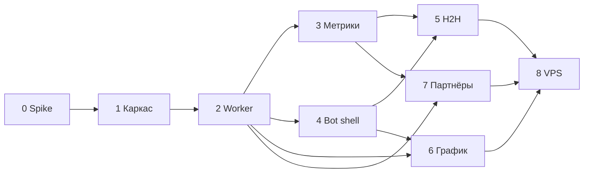

# План реализации

> Этапы, зависимости и критерии готовности.  
> Актуально на основе [`BRIEF.md`](BRIEF.md). Целевая аудитория — **парные игроки**.  
> **Этап 0 завершён** — отчёт spike: [`spike-parser.md`](spike-parser.md).

## Принятые допущения для плана

| Тема | Решение |
|---|---|
| Аудитория / MVP | Парные дисциплины: **D, MD, WD, XD**; одиночка — вторично |
| Репозиторий | Maven **multi-module**: `core`, `worker`, `bot` |
| Парсер | Многопоточность, пул **8–16** потоков, **≤10 req/s** на хост, retry |
| Бот | **Публичный**, без доп. авторизации |
| Деплой | **Docker Compose локально** → VPS позже |
| Telegram | **Long polling** |
| Тесты | **HTML-fixtures** в `test/resources` с первого этапа |
| Подбор партнёров | **Этап 7** (после стабильного парного H2H) |

---

## Обзор этапов

```
[0 Spike ✓] → [1 Каркас ✓] → [2 Worker слепок] → [3 Метрики] → [4 Bot shell]
    → [5 H2H пары] → [6 График рейтинга] → [7 Партнёры] → [8 VPS деплой]
                                                              → [9+ Roadmap]
```

---

## Этап 0 — Spike парсера (парные данные) ✓

**Статус:** завершён (2026-07-21). Отчёт и выводы: **[`spike-parser.md`](spike-parser.md)**.

**Цель:** подтвердить, что с badminton4u.ru можно стабильно получить данные для парных игроков.

**Задачи (выполнено):**
- HTML-fixtures: список турниров, будущий/прошедший парный турнир, профиль игрока, `gamesd` турнира.
- Прототип парсеров в `worker`: пары, pair-vs-pair, `external_key` матчей, агрегатор соперников.
- Зафиксировано: регистрация SSR/AJAX; `/rivals` отвергнут — соперники из `gamesd`.

**Итог spike (кратко):**
- Pair-vs-pair **GO** через `gamesd/?tourID=` (SSR, 4 игрока на матч).
- Регистрация: SSR в `#tour-reg-list1` **или** AJAX (`POST /?ajax`) — worker поддержит оба варианта.
- Модуль `worker`, Java **17** (spike), **5** fixtures, 5 парсеров + агрегатор, unit-тесты green.
- Эталоны: игрок [18499](https://badminton4u.ru/players/18499), турниры [12713](https://badminton4u.ru/tournaments/12713) / [12834](https://badminton4u.ru/tournaments/12834).

**DoD:**
- [x] Отчёт в [`docs/spike-parser.md`](spike-parser.md): go/no-go по pair-vs-pair.
- [x] ≥5 fixtures в `worker/src/test/resources/html/` (фактически **5**).
- [x] Парсер проходит unit-тесты на fixtures для: турнир, пара в регистрации, итоговая строка пары.

**Оценка:** 2–4 дня.

---

## Этап 1 — Каркас проекта ✓

**Статус:** завершён (2026-07-21).

**Цель:** собираемый multi-module проект + локальная инфраструктура.

**Задачи (выполнено):**
- Maven parent + модули:
  - **`core`** — JPA-сущности, репозитории, Flyway-миграции (из [`schema.sql`](schema.sql)), конфиг-параметры метрик.
  - **`worker`** — зависит от `core`, Spring Boot без web (actuator).
  - **`bot`** — зависит от `core`, Spring Boot + Telegram long polling.
- `docker-compose.yml`: PostgreSQL (+ pg_trgm), порт **5433** (обход локального Postgres на 5432).
- Flyway V1: перенос `schema.sql` в `core/src/main/resources/db/migration/`.
- `.env.example`: `BOT_TOKEN`, `DB_*`, параметры парсера (`PARSER_THREADS`, `PARSER_MAX_RPS`).
- **`dev.ps1` / `dev.cmd`** — короткие команды запуска/остановки компонентов (см. [`README.md`](README.md)).

**DoD:**
- [x] `./mvnw clean verify` проходит.
- [x] `docker compose up -d postgres` + приложение подключается к БД, миграции накатываются.
- [x] Bot отвечает на `/start` (заглушка).

**Оценка:** 3–5 дней.

---

## Этап 2 — Worker: полный слепок региона

**Цель:** ежедневный слепок Москва/МО за 3 года в PostgreSQL.

**Задачи:**
- Pipeline (многопоточный, rate-limited):
  1. Турниры `r77` (фильтр парные типы + все прошедшие/будущие в окне 3 лет).
  2. Страница турнира → участники, пары, `Participation`, `Pair`, `TournamentRegistration`.
  3. Для **завершённых** парных турниров: `gamesd/?tourID=` → `Match`, `match_player`;
     `RivalSummaryAggregator` → `rival_summary` (player↔player W/L).
  4. Профили игроков → `Player`, `player_rating`, `player_rating_history`.
- Идемпотентность: upsert по external ID, `snapshot_meta.last_sync_at`.
- Spring `@Scheduled` — раз в сутки; ручной trigger для dev.
- Метрики worker: число турниров/игроков, ошибки, длительность слепка.

**DoD:**
- [ ] Первый полный слепок r77 завершается локально (время зафиксировать в README).
- [ ] Повторный слепок идемпотентен (нет дублей).
- [ ] Unit/integration тесты парсера на fixtures ≥80% ключевых парсеров.

**Оценка:** 1–2 недели (зависит от spike).

---

## Этап 3 — Метрики (core)

**Цель:** воспроизводимые расчёты S, Form, P3, score партнёра.

**Задачи:**
- Сервисы в `core` (чистая логика + доступ к БД):
  - `PlayabilityIndexService` — S по списку дат встреч.
  - `FormService` — Form по дельтам с полураспадом.
  - `ForecastService` — P3 (логистика, Laplace, blend).
  - `PairRatingService` — (A+B)/2 + бонус S_partner.
  - `PartnerScoreService` — score 0–100 для подбора (этап 7).
- Конфиг: `H`, `k`, `S_ref`, `Bmax`, `S0`, `w1..w3`, `D_scale`, `T` месяцев — `application.yml`.
- Unit-тесты на синтетических данных + 2–3 кейса с реальными числами из fixtures.

**DoD:**
- [ ] Формулы совпадают с [`BRIEF.md`](BRIEF.md).
- [ ] Тесты green без БД (где возможно) + интеграционные с testcontainers Postgres.

**Оценка:** 4–6 дней.

---

## Этап 4 — Bot: shell + поиск + карточка

**Цель:** пользователь находит игрока и видит карточку (парный фокус).

**Задачи:**
- `/start` — меню: «Найти игрока», «Сравнить (H2H)», «Помощь» + свободный ввод.
- Поиск: pg_trgm, от 3 символов, ник или ФИО → список до 10 (ник, ФИО, город).
- Карточка: ник, ФИО, город, **рейтинги D/MD/WD/XD**, последний турнир; кнопки «Соперники», «H2H», «История рейтинга».
- Соперники: топ по играм + пагинация (парная дисциплина по умолчанию или последняя активная).
- Footer: «Данные на DD.MM.YYYY» из `snapshot_meta`.
- Обработка «не найден» с подсказками.

**DoD:**
- [ ] Сценарии из BRIEF §5 проходят вручную против локальной БД после слепка.
- [ ] Нагрузочно: поиск <500 ms на индексе ≥5k игроков (ориентир).

**Оценка:** 1 неделя.

---

## Этап 5 — Bot: H2H для пар

**Цель:** ключевая ценность для парных игроков.

**Задачи:**
- Вход: из карточки + `/h2h` (A → B → **выбор дисциплины** D/MD/WD/XD).
- Для пар: выбор **двух игроков** или двух **пар** (если spike подтвердил pair-vs-pair; иначе — игрок vs игрок в парном разряде + пометка ограничения).
- Экран: W-L, последние матчи (`games` lazy-load + кеш), S, Form обоих, **прогноз P3** с парным рейтингом.
- Lazy fetch `games` при первом H2H, сохранение в `match` / `match_player`.

**DoD:**
- [ ] 5 эталонных пар H2H сверены с сайтом вручную.
- [ ] Прогноз отображается как «Фаворит A (≈N%)» + обоснование.

**Оценка:** 1–1.5 недели.

---

## Этап 6 — График рейтинга

**Цель:** кнопка «История рейтинга» → PNG.

**Задачи:**
- Генерация PNG (JFreeChart) из `player_rating_history`.
- Выбор дисциплины на графике; отправка как `SendPhoto` в Telegram.
- Кеш файлов опционально (TTL 24ч).

**DoD:**
- [ ] График для 3 тестовых игроков совпадает по точкам с сайтом.
- [ ] Время генерации <2 с.

**Оценка:** 2–4 дня.

---

## Этап 7 — Подбор партнёра на турнир

**Цель:** слой 2 из BRIEF.

**Задачи:**
- Экран ближайшего **будущего** турнира → «Найти партнёра».
- Пул: уровень + не в паре на турнире + гео r77 + `(A+B)/2 ≤ limit`.
- Два блока + score; boost ×1.2 для «Уже играли успешно».
- Пользователь = поиск своего профиля (без TG-привязки).

**DoD:**
- [ ] На 3 реальных будущих турнирах список кандидатов выглядит правдоподобно (ручная ревизия).
- [ ] Score сортирует стабильно при одинаковых фильтрах.

**Оценка:** 1 неделя.

---

## Этап 8 — Публичный деплой (VPS)

**Цель:** бот доступен 24/7.

**Задачи:**
- Docker Compose на VPS: postgres, worker, bot.
- Секреты через env / docker secrets; не коммитить `.env`.
- Long polling; логирование; restart policy.
- Мониторинг минимум: health actuator, алерт при падении слепка.

**DoD:**
- [ ] Бот отвечает с VPS; слепок по расписанию UTC.
- [ ] Документация деплоя в `docs/DEPLOY.md`.

**Оценка:** 2–3 дня.

---

## Этап 9+ — Roadmap (не в v1)

| Направление | Зависимости |
|---|---|
| Привязка TG↔игрок | UX «мой профиль», «мои соперники» |
| Граф связанности | Полный слепок + визуализация |
| Калибровка конфига | Накопленные данные, A/B на эталонах |
| `badminton77.ru` | Лайв-календарь |
| Лайв-помощник | Сетка, счёт по партиям, офлайн |
| Webhook вместо polling | Домен + HTTPS |

---

## Зависимости между этапами



---

## Риски

| Риск | Митигация |
|---|---|
| Парные `rivals` на `/rivals/{id}` | **Не используем** — соперники только из `gamesd` при анализе турнира |
| Pair-vs-pair недоступен | **Снят** — pair-vs-pair через `gamesd/?tourID=`; см. [`spike-parser.md`](spike-parser.md) |
| Долгий первый слепок | Тюнинг пула/RPS; incremental sync по `updated_at` (позже) |
| Блокировка парсера | Rate-limit, User-Agent с контактом, backoff |
| Публичный бот без auth | Rate-limit на команды TG, мониторинг злоупотреблений |

---

## Следующий шаг

**Этап 2:** worker — полный слепок региона r77 (турниры, участники, `gamesd`, профили, идемпотентный upsert).  
Локальный запуск — [`README.md`](README.md) (`dev.ps1`). Spike-парсер: [`spike-parser.md`](spike-parser.md).
