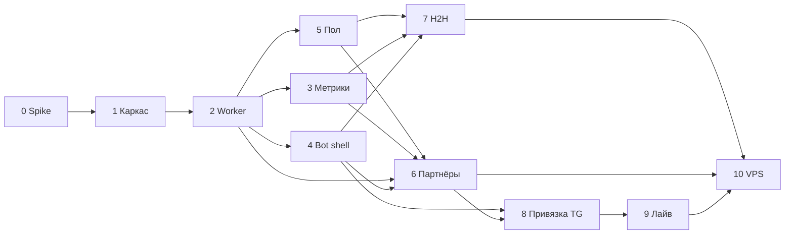

# План реализации

> Этапы, зависимости и критерии готовности.  
> Актуально на основе [`BRIEF.md`](BRIEF.md). Целевая аудитория — **парные игроки**.  
> **Этап 0 завершён** — отчёт spike: [`spike-parser.md`](spike-parser.md).

## Принятые допущения для плана

| Тема | Решение |
|---|---|
| Аудитория / MVP | Парные дисциплины: **D, MD, WD, XD**; одиночка — вторично |
| Репозиторий | Maven **multi-module**: `core`, `worker`, `bot` |
| Парсер | Многопоточность, пул **8–16** потоков, **≤10 req/s** на хост, retry |
| Бот | **Публичный**, без доп. авторизации |
| Деплой | **Docker Compose локально** → VPS позже |
| Telegram | **Long polling** |
| Тесты | **HTML-fixtures** в `test/resources` с первого этапа |
| Пол игрока | **Этап 5 ✓** (блокирует H2H и подбор партнёров — тип пары однополая/микст) |
| Подбор партнёров | **Этап 6** (перед H2H) |
| Привязка TG↔игрок | **Этап 8** (до деплоя; «Мой профиль», персонализация) |
| Лайв-помощник | **Этап 9** (до деплоя; слой 3, минимальный MVP) |
| График рейтинга | **v2** (не в v1) |

---

## Обзор этапов

```
[0 Spike ✓] → [1 Каркас ✓] → [2 Worker ✓] → [3 Метрики ✓] → [4 Bot shell ✓]
    → [5 Пол ✓] → [6 Партнёры] → [7 H2H] → [8 Привязка TG] → [9 Лайв] → [10 VPS]
                                                                        → [v2+ Roadmap]
```

---

## Этап 0 — Spike парсера (парные данные) ✓

**Статус:** завершён (2026-07-21). Отчёт и выводы: **[`spike-parser.md`](spike-parser.md)**.

**Цель:** подтвердить, что с badminton4u.ru можно стабильно получить данные для парных игроков.

**Задачи (выполнено):**
- HTML-fixtures: список турниров, будущий/прошедший парный турнир, профиль игрока, `gamesd` турнира.
- Прототип парсеров в `worker`: пары, pair-vs-pair, `external_key` матчей, агрегатор соперников.
- Зафиксировано: регистрация SSR/AJAX; `/rivals` отвергнут — соперники из `gamesd`.

**Итог spike (кратко):**
- Pair-vs-pair **GO** через `gamesd/?tourID=` (SSR, 4 игрока на матч).
- Регистрация: SSR в `#tour-reg-list1` **или** AJAX (`POST /?ajax`) — worker поддержит оба варианта.
- Модуль `worker`, Java **17** (spike), **5** fixtures, 5 парсеров + агрегатор, unit-тесты green.
- Эталоны: игрок [18499](https://badminton4u.ru/players/18499), турниры [12713](https://badminton4u.ru/tournaments/12713) / [12834](https://badminton4u.ru/tournaments/12834).

**DoD:**
- [x] Отчёт в [`docs/spike-parser.md`](spike-parser.md): go/no-go по pair-vs-pair.
- [x] ≥5 fixtures в `worker/src/test/resources/html/` (фактически **5**).
- [x] Парсер проходит unit-тесты на fixtures для: турнир, пара в регистрации, итоговая строка пары.

**Оценка:** 2–4 дня.

---

## Этап 1 — Каркас проекта ✓

**Статус:** завершён (2026-07-21).

**Цель:** собираемый multi-module проект + локальная инфраструктура.

**Задачи (выполнено):**
- Maven parent + модули:
  - **`core`** — JPA-сущности, репозитории, Flyway-миграции (из [`schema.sql`](schema.sql)), конфиг-параметры метрик.
  - **`worker`** — зависит от `core`, Spring Boot без web (actuator).
  - **`bot`** — зависит от `core`, Spring Boot + Telegram long polling.
- `docker-compose.yml`: PostgreSQL (+ pg_trgm), порт **5433** (обход локального Postgres на 5432).
- Flyway V1: перенос `schema.sql` в `core/src/main/resources/db/migration/`.
- `.env.example`: `BOT_TOKEN`, `DB_*`, параметры парсера (`PARSER_THREADS`, `PARSER_MAX_RPS`).
- **`dev.ps1` / `dev.cmd`** — короткие команды запуска/остановки компонентов (см. [`README.md`](README.md)).

**DoD:**
- [x] `./mvnw clean verify` проходит.
- [x] `docker compose up -d postgres` + приложение подключается к БД, миграции накатываются.
- [x] Bot отвечает на `/start` (заглушка).

**Оценка:** 3–5 дней.

---

## Этап 2 — Worker: полный слепок региона ✓ (реализация)

**Цель:** ежедневный слепок Москва/МО за 3 года в PostgreSQL.

**Статус:** реализовано и проверено дымовым прогоном (см. ниже). Полный 3-летний слепок
r77 запускается пользователем (heavy live-scrape).

**Задачи (выполнено):**
- HTTP-слой: `RateLimiter` (глобальный ≤ maxRps), `HttpFetcher` (jsoup, UA, retry+backoff, 404 без ретрая),
  `Badminton4uClient` (URL: список призёров по типу, страница турнира, `gamesd`, профиль).
- Pipeline (многопоточный, rate-limited) в `worker.snapshot`:
  1. Завершённые турниры `r77` **раздельными запросами по типам** (`types[]=d/md/wd/xd`) → дисциплина из фильтра.
  2. Страница турнира → `TournamentResultsParser` → `Participation`, `Pair` (пары через `PairService`, идемпотентно).
  3. `gamesd/?tourID=` → `Match`, `match_player` (идемпотентность по `source+external_key`).
  4. Профили игроков (dedup) → `Player`, `player_rating`, `player_rating_history` (по всем дисциплинам).
  5. `rival_summary` (вариант C) — **полная пересборка** из БД (`RivalSummaryRebuildService`), идемпотентно.
- Идемпотентность: upsert по external ID; `snapshot_meta.last_sync_at` + окно.
- Spring `@Scheduled` (флаг `scheduled-enabled`, cron) + ручной dev-trigger (`run-on-startup`, синхронно).
- **Точечный re-import** по списку ID (`SNAPSHOT_TOURNAMENT_IDS`) — без полного обхода списка турниров.
- Метрики прогона (`SnapshotMetrics`): турниры/игроки/матчи/rival/ошибки/длительность (в лог).
- Регистрация будущих турниров (`TournamentRegistration`, SSR/AJAX) **реализована в этапе 6** (`UpcomingTournamentsSyncService`).

**DoD:**
- [x] Слепок r77 завершается локально. Дымовой прогон (1 дисциплина WD, лимит 3 турнира, ≤5 req/s):
  ~9 c, 32 игрока, 41 матч, 272 строки `rival_summary`, 0 ошибок. Полный 3-летний — за пользователем.
- [x] Повторный слепок идемпотентен: 2-й прогон — 0 новых матчей, 0 ошибок, `rival_summary` стабилен.
- [x] Unit-тесты парсеров на fixtures (green) + unit-тесты мапперов (`SnapshotSupportTest`).
  Testcontainers-интеграция отложена (проверка идемпотентности — вручную на локальной БД).

**Оценка:** 1–2 недели (зависит от spike).

---

## Этап 3 — Метрики (core) ✓ (реализация)

**Цель:** воспроизводимые расчёты S, Form, P3, рейтинг пары.

**Статус:** реализовано (2026-07-22). Чистые расчётные сервисы в пакете `core.metrics`,
21 unit-тест (синтетика + реальные числа), `mvn clean verify` green.

**Задачи (выполнено):**
- Сервисы в `core.metrics` (чистая логика, константы из `MetricsProperties`):
  - `PlayabilityIndexService` — S по списку дат встреч.
  - `FormService` — Form по дельтам с полураспадом (вход — `RatingDeltaEvent`).
  - `PairRatingService` — официальный `(A+B)/2` + прогнозный `+ Bmax·(1-0.5^(S_partner/S0))`.
  - `ForecastService` — P3 (логистика, Laplace, blend); универсален для одиночки и пар,
    результат — `ForecastResult` (P, P_model, P_h2h, w, R_eff) для показа обоснования.
  - Общий helper `MetricMath` (затухание по полураспаду, сигмоида).
- Регистрация бинов: `@ComponentScan("ru.badmintonlab.core.metrics")` в `CoreJpaConfig`
  (подхватывается worker/bot через `@Import`).
- Unit-тесты на синтетике + реальные числа (`ForecastServiceTest#combinedRealisticCase` и др.).

**Отложено:**
- `PartnerScoreService` — **этап 6 ✓** (`s-ref-partner`, `partner-boost` в конфиге).
- Сборка входных данных из БД (H2H-запрос к `Match`, даты/дельты) — на **этап 7**, где потребляется
  ботом и проверяется на реальном слепке.
- Testcontainers-интеграция — отложена (как на этапе 2): сервисы этапа 3 — чистая логика,
  тестируются без БД.

**DoD:**
- [x] Формулы совпадают с [`BRIEF.md`](BRIEF.md) / [`FORMULAR.md`](FORMULAR.md).
- [x] Тесты green без БД. Интеграция с testcontainers Postgres — отложена (см. «Отложено»).

**Оценка:** 4–6 дней.

---

## Этап 4 — Bot: shell + поиск + карточка ✓ (реализация)

**Цель:** пользователь находит игрока и видит карточку (парный фокус).

**Статус:** реализовано (2026-07-22). Каркас бота: меню, поиск, карточка, соперники —
диспетчер `bot.handler.UpdateDispatcher` (чистая логика, возвращает методы API → тестируемо),
сервисы чтения в `bot.service`, представление в `bot.view` (HTML, inline-клавиатуры,
`CallbackData`). `mvn clean verify` green (bot — 20 unit-тестов).

**Задачи (выполнено):**
- `/start` — меню (inline): «Найти игрока», «Сравнить (H2H)», «Помощь» + свободный ввод = поиск.
- Поиск (`PlayerSearchService` + `PlayerRepository.search`): pg_trgm, от 3 символов, ник/ФИО —
  подстрочный `ILIKE` по нику/фамилии/имени/«Фамилия Имя» + сортировка по `similarity` → до 10.
- Карточка (`PlayerCardService`): ник, ФИО, город, **рейтинги S/D**, форма 👊, **игровой акцент** (🎯/💪),
  последний турнир; кнопки «Соперники», «H2H», «История рейтинга».
- Соперники (`RivalService`): топ по числу встреч + пагинация (по 8), переключатель дисциплин,
  дисциплина по умолчанию — парная (D/MD/WD/XD) с максимумом встреч, иначе самая активная.
- Footer: «Данные на DD.MM.YYYY» из `snapshot_meta` (последний слепок).
- Обработка «не найден» и «слишком короткий запрос» с подсказками.

**Отложено (по плану):**
- Кнопка «H2H» — заглушка (этап 6). Кнопка «История рейтинга» — заглушка (**v2**, см. Roadmap).
- Нагрузочное измерение поиска и ручной прогон сценариев BRIEF §5 — на **живой БД после слепка**
  (нужен `BOT_TOKEN` и наполненная база; см. `README.md`).

**Принятые решения (дефолты этапа):**
- Дисциплины на карточке — только парные D/MD/WD/XD (парный фокус MVP).
- Ярлыки дисциплин — коды как на источнике (D/MD/WD/XD/…), без изобретения локализации.
- Навигация: переход на новый экран (поиск → карточка → соперники) — `SendMessage`; фильтр/пагинация соперников и H2H-wizard — `EditMessageText`.

**DoD:**
- [x] Сборка `mvn clean verify` green; unit-тесты диспетчера/форматирования/CallbackData.
- [ ] Сценарии из BRIEF §5 проходят вручную против локальной БД после слепка.
- [ ] Нагрузочно: поиск <500 ms на индексе ≥5k игроков (ориентир).

**Оценка:** 1 неделя.

---

## Этап 5 — Worker: пол игрока (справочник `players/`) ✓ (реализация)

**Цель:** явно хранить пол игрока в БД — основа для **типа пары** (однополая / микст) в H2H и фильтра кандидатов при подборе партнёра.

**Статус:** реализовано (2026-07-23). Flyway V2 (`player.sex`), парсер справочника с AJAX-пагинацией,
`PlayerSexSyncService` в pipeline слепка, `PairCompositionService` в `core.metrics`. `mvn clean verify` green.

**Контекст:** на странице профиля `/players/{id}` пол **не отображается** (есть город, дата рождения, рука).
Основной источник — справочник `players/?sex_m/f=1` (singles) и `players/?type=d&sex_m/f=1` (doubles);
см. [`BRIEF.md`](BRIEF.md) §2, §10.

**Задачи (выполнено):**
- Fixtures: `players-directory-sex-m-r77.html`, `players-directory-sex-f-r77.html`, `players-directory-ajax-page2.html`.
- `PlayerDirectoryParser` + `PlayerDirectoryLoader` (GET + AJAX `POST /?ajax`, сессия jsoup).
- Flyway **V2**: `player.sex` (`M`/`F`, nullable).
- `PlayerSexUpsertService` / `PlayerSexSyncService` / `PlayerSexProfileFallbackService` — после `upsertPlayers` в `SnapshotService`.
- `SexSyncStartupRunner` — разовый sync (`SNAPSHOT_SYNC_SEX_ON_STARTUP=true`).
- Fallback при `sex IS NULL`: (1) локальный слепок r77 — рейтинги и участия; (2) **профиль игрока на сайте** — участия всех регионов; (3) **ФИО из БД** (офлайн) — отчество, типичные русские имена; `NameSexStartupRunner` (`SNAPSHOT_INFER_SEX_FROM_NAMES_ON_STARTUP=true`).
- `PairCompositionService` в `core.metrics` (MD/WD/XD/UNKNOWN).
- Unit-тесты парсера, `PairCompositionService`, `PlayerSexInference`; [`spike-parser.md`](spike-parser.md) обновлён.

**Принятые решения (дефолты этапа):**
- Справочник — **authoritative**: повторный прогон перезаписывает `sex` из списка M/F (не «мигает» при неизменном источнике).
- Справочник: **singles** (`players/?sex_m/f`) + **doubles** (`players/?type=d&sex_m/f`); объединение по ID.
- Пагинация списка — AJAX `POST /?ajax` с телом `players={data-rand}&limit=N` в той же сессии, что и GET первой страницы.
- Fallback из дисциплин — только если `sex IS NULL`: сначала локальные данные слепка r77, затем SSR-профиль `/players/{id}` (участия без `cities[]`), затем ФИО (`PlayerSexInference.inferFromName`); generic D/XD и X* — не используются; конфликт M+W или имя+отчество → не заполняем.
- Fallback по ФИО — **не authoritative** (эвристика); справочник при sync перезаписывает; ручные override по ID — в `PlayerSexUpsertService.MANUAL_SEX_OVERRIDES`.

**DoD:**
- [x] На дымовом прогоне r77 ≥90% игроков имеют `sex` (**99,96%** после fallback по ФИО 2026-07-23: 4913/4915; без пола — 2 записи: неоднозначное имя / нет ФИО).
- [ ] 10 эталонных игроков (5M + 5F) сверены вручную со списками на сайте.
- [ ] Повторный прогон идемпотентен (пол не «мигает»).
- [x] `PairCompositionService` покрыт unit-тестами (все комбинации M/F/NULL).
- [x] `PlayerDirectoryParser` + fixtures; `mvn clean verify` green.

**Зависимости:** этап 2 (слепок, таблица `player`).
**Блокирует:** этап 7 (H2H — тип пары), этап 6 (фильтр кандидатов по полу).
**Не блокирует:** этапы 8–10.

**Оценка:** 2–4 дня (spike списка + миграция + интеграция в worker).

---

## Этап 6 — Подбор партнёра на турнир ✓ (реализация)

**Цель:** слой 2 из BRIEF.

**Статус:** реализовано (2026-07-24). Worker: `UpcomingTournamentsSyncService` + регистрация; core: `PartnerScoreService`;
bot: меню «🤝 Партнёр на турнир», выбор турнира → «кто вы» → два блока кандидатов.

**Задачи (выполнено):**
- Синхронизация **будущих** парных турниров r77 (до 90 дней, ≤40 шт.) и `tournament_registration` после слепка.
- Экран ближайших турниров → выбор → поиск «я» → список кандидатов.
- Пул: `(A+B)/2 ≤ limit`, не в подтверждённой паре на турнире, **пол** по разряду (MD/WD/XD), пул r77.
- Два блока («Уже играли» / «Новые кандидаты»), score §2.5, boost ×1.2 для успешной истории; в «Уже играли» успешные выше.
- **Приоритет в сортировке:** сначала кандидаты, у которых **рекомендуемая категория** (игровой акцент,
  `GameAccentService.preferenceType`) совпадает с разрядом турнира (MD/WD/XD), затем score.
- **Идеальный партнёр (⭐):** успешная совместная история + совпадение категории + форма &gt; 0 + лимит/пол/не в паре на турнире.

**DoD:**
- [x] `PartnerScoreService` + конфиг `s-ref-partner`, `partner-boost`; unit-тесты.
- [x] Bot-flow и тексты (`docs/messages/08-partner-pick.md` — актуализировать при UX-ревью).
- [ ] На 3 реальных будущих турнирах список кандидатов выглядит правдоподобно (ручная ревизия).
- [ ] Score и приоритет категории стабильны при повторном запросе.

**Зависимости:** этапы 2 (слепок), 3 (метрики), 5 (пол).

**Оценка:** 1 неделя.

---

## Этап 7 — Bot: H2H для пар

**Цель:** ключевая ценность для парных игроков; прогноз и сравнение с учётом **типа пары** (однополая / микст).

**Контекст:** базовый H2H-wizard уже в боте; этап — доведение до DoD (дисциплина, тип пары, прогноз P3, lazy `games`).

**Задачи:**
- Вход: из карточки + `/h2h` (A → B → **выбор дисциплины** D/MD/WD/XD).
- Для пар: выбор **двух игроков** или двух **пар** (pair-vs-pair через `gamesd`; иначе — игрок vs игрок + пометка ограничения).
- **Тип пары:** для каждой стороны — `PairCompositionService` по `player.sex` двух игроков;
  на экране — метка «мужская пара» / «женская пара» / «микст» (или «пол неизвестен»).
- **Согласование с разрядом:** при выборе MD/WD/XD — предупреждение, если состав не соответствует
  (напр. микст при MD); для generic `D` — подсказка фактического типа по полу, если известен.
- Экран: W-L, последние матчи (`games` lazy-load + кеш), S, Form обоих, **прогноз P3** с парным рейтингом.
- Lazy fetch `games` при первом H2H, сохранение в `match` / `match_player`.
- Сборка входных данных из БД (H2H-запрос к `Match`, даты/дельты) — здесь, на реальном слепке.

**DoD:**
- [ ] 5 эталонных пар H2H сверены с сайтом вручную.
- [ ] Прогноз отображается как «Фаворит A (≈N%)» + обоснование.
- [ ] Тип пары (однополая/микст) отображается корректно для 5 эталонных составов (MD, WD, XD).

**Зависимости:** этапы 3 (метрики), 4 (bot shell), **5 (пол + PairCompositionService)**.

**Оценка:** 1–1.5 недели.

---

## Этап 8 — Привязка Telegram ↔ игрок

**Цель:** персонализация — «Мой профиль» без повторного поиска; основа для лайв-слоя и быстрого подбора партнёра.

**Задачи:**
- Flyway **V3** (или следующий номер): таблица связи `telegram_user_id` ↔ `player_id` (1:1 на TG-аккаунт).
- Сценарий: меню «Мой профиль» / `/me` → если не привязан: поиск + подтверждение «Это вы?» → сохранение;
  если привязан: карточка своего игрока + «Отвязать».
- Интеграция: подбор партнёра (этап 6) и лайв (этап 9) используют привязку по умолчанию.
- Защита: идемпотентная привязка, явная отвязка, без перезаписи чужой привязки без подтверждения.

**DoD:**
- [ ] Привязка / отвязка / повторный вход работают вручную на локальном боте.
- [ ] «Найти партнёра» подставляет привязанного игрока без поиска.

**Зависимости:** этап 4 (bot shell, поиск). **Желательно после:** этап 6 (партнёры) или параллельно.

**Оценка:** 2–4 дня.

---

## Этап 9 — Лайв-помощник (MVP слоя 3)

**Цель:** минимальный активный сценарий на турнире — счёт по сетам и простая сетка; собственные данные бота (не парсинг).

**Контекст:** см. [`BRIEF.md`](BRIEF.md) §1 слой 3. Точный счёт **по очкам в партии** недоступен на источнике — только **по сетам** (2:0, 2:1).
Детальные формулы сетки и UX — уточнять при реализации (не выдумываем в плане).

**Задачи (каркас этапа):**
- Spike / дизайн-сообщения: экран «Турнир live», создание/выбор матча, ввод счёта по сетам.
- Модель данных: live-сессия, матч, результат (Flyway); привязка к `player` через этап 8.
- Bot: FSM ведения матча (старт → сеты → финиш); офлайн-tolerant — данные в БД, не только в памяти сессии.
- MVP-объём: **один** сценарий (напр. парный матч 2 из 3 сетов) без интеграции `badminton77.ru` (календарь — v2).

**DoD:**
- [ ] Один эталонный сценарий «создать матч → ввести счёт 2:0 → результат сохранён в БД» проходит вручную.
- [ ] Дизайн экранов зафиксирован в `docs/messages/` (новый файл или § в существующем).

**Зависимости:** этап 8 (привязка игрока). **Не блокирует:** деплой технически, но по продуктовому решению — **до этапа 10**.

**Оценка:** 1–2 недели (зависит от глубины сетки в MVP).

---

## Этап 10 — Публичный деплой (VPS)

**Цель:** бот доступен 24/7; в v1 входят слои 1–3 (H2H, партнёры, лайв), **без** графика рейтинга.

**Задачи:**
- Docker Compose на VPS: postgres, worker, bot.
- Секреты через env / docker secrets; не коммитить `.env`.
- Long polling; логирование; restart policy.
- Мониторинг минимум: health actuator, алерт при падении слепка.

**DoD:**
- [ ] Бот отвечает с VPS; слепок по расписанию UTC.
- [ ] Документация деплоя в `docs/DEPLOY.md`.

**Оценка:** 2–3 дня.

---

## Технический долг (ревью качества кода, 2026-07-22)

По итогам ревью на соответствие best-practice Java. Проблемы среднего приоритета,
которые нельзя безопасно закрыть без живой БД/крупного рефакторинга, вынесены сюда.

| # | Проблема | Действие | Целевой этап |
|---|---|---|---|
| 1 | `HttpFetcher.post()` фактически делал GET (`.get()` перекрывает `.method(POST)` в jsoup) | **Исправлено 2026-07-22** — используется `connection.data(data).post()`. Проверить на реальной AJAX-регистрации | 7 |
| 2 | `RivalSummaryRebuildService.rebuild()` грузит `match` + `match_player` целиком в память (`findAll`) и делает полный `delete`+`saveAll` в одной транзакции | Переписать пересборку на агрегирующий SQL (`INSERT ... SELECT` / нативный upsert на стороне PostgreSQL); проверить на полном слепке r77 | 6 (на реальном объёме) |
| 3 | Нет интеграционных тестов на БД: нативный pg_trgm-поиск `PlayerRepository.search` и JPQL-проекции rival-запросов проверяются только вручную | Ввести Testcontainers (PostgreSQL + pg_trgm), покрыть поиск и rival-запросы/проекции | 6 |
| 4 | Хрупкие тест-фейки бота: наследование сервисов с `super(null)` из-за `surefire forkCount=0` (Mockito недоступен) | Выделить интерфейсы сервисов бота (или устранить `forkCount=0` и перейти на Mockito) | 6 (вместе с п.3) |

Мелкие стилевые правки (Locale.ROOT в `toLowerCase`, `static final Pattern`, дедуп запроса
дисциплин в `RivalService`, импорты вместо полных имён) — по мере касания соответствующих файлов,
отдельного этапа не требуют.

---

## v2+ — Roadmap (после публичного деплоя)

| Направление | Зависимости |
|---|---|
| **График рейтинга** | PNG из `player_rating_history` (JFreeChart); кнопка на карточке — сейчас заглушка |
| Граф связанности | Полный слепок + визуализация |
| Калибровка конфига | Накопленные данные, A/B на эталонах |
| `badminton77.ru` | Лайв-календарь, расширение лайв-слоя |
| Лайв: сетка турнира, офлайн-sync | Расширение этапа 9 |
| Webhook вместо polling | Домен + HTTPS |

---

## Зависимости между этапами



---

## Риски

| Риск | Митигация |
|---|---|
| Парные `rivals` на `/rivals/{id}` | **Не используем** — соперники только из `gamesd` при анализе турнира |
| Pair-vs-pair недоступен | **Снят** — pair-vs-pair через `gamesd/?tourID=`; см. [`spike-parser.md`](spike-parser.md) |
| Долгий первый слепок | Тюнинг пула/RPS; incremental sync по `updated_at` (позже) |
| Блокировка парсера | Rate-limit, User-Agent с контактом, backoff |
| Публичный бот без auth | Rate-limit на команды TG, мониторинг злоупотреблений |

---

## Следующий шаг

**Следующий шаг:** этап **7 — H2H для пар** (DoD поверх текущего wizard); ручная ревизия подбора партнёра на 3 турнирах.

**Дальше по v1:** 7 H2H → 8 привязка TG → 9 лайв → **10 VPS**.
График рейтинга — **v2** (не блокирует деплой).

Для наполнения БД — полный 3-летний слепок r77 (`SNAPSHOT_MAX_TOURNAMENTS=0`, все дисциплины);
локальный запуск слепка и бота (`BOT_TOKEN`, `TELEGRAM_BOT_ENABLED=true`) — [`README.md`](README.md).
