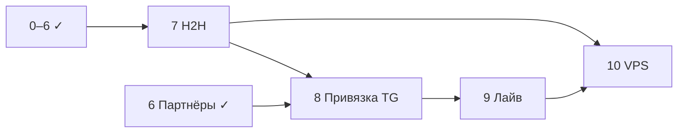

# План реализации

> Этапы **7–10**, техдолг и roadmap. Завершённые **0–6** — [`PLAN-COMPLETED.md`](PLAN-COMPLETED.md).  
> Продуктовые решения — [`BRIEF.md`](BRIEF.md). Целевая аудитория — **парные игроки**.

## Принятые допущения для плана

| Тема | Решение |
|---|---|
| Аудитория / MVP | Парные дисциплины: **D, MD, WD, XD**; одиночка — вторично |
| Репозиторий | Maven **multi-module**: `core`, `worker`, `bot` |
| Парсер | Многопоточность, пул **8–16** потоков, **≤10 req/s** на хост, retry |
| Бот | **Публичный**, без доп. авторизации |
| Деплой | **Docker Compose локально** → VPS позже |
| Telegram | **Long polling** |
| Тесты | **HTML-fixtures** в `test/resources` с первого этапа |
| Пол игрока | **Этап 5 ✓** |
| Подбор партнёров | **Этап 6 ✓** (перед DoD H2H) |
| Привязка TG↔игрок | **Этап 8** (до деплоя) |
| Лайв-помощник | **Этап 9** (до деплоя) |
| График рейтинга | **v2** (не в v1) |

---

## Обзор этапов

```
[0–6 ✓] → [7 H2H DoD] → [8 Привязка TG] → [9 Лайв] → [10 VPS] → [v2+ Roadmap]
```

| Этап | Статус | Кратко |
|---|---|---|
| 0–6 | ✓ | Spike … подбор партнёра — см. [`PLAN-COMPLETED.md`](PLAN-COMPLETED.md) |
| **7** | **→ текущий** | H2H: дисциплина, тип пары, P3, lazy `games` |
| 8 | planned | TG ↔ player |
| 9 | planned | Лайв MVP |
| 10 | planned | VPS |

---

## Этап 7 — Bot: H2H для пар

**Цель:** ключевая ценность для парных игроков; прогноз и сравнение с учётом **типа пары** (однополая / микст).

**Контекст:** базовый H2H-wizard уже в боте; этап — доведение до DoD (дисциплина, тип пары, прогноз P3, lazy `games`).

**Задачи:**
- Вход: из карточки + `/h2h` (A → B → **выбор дисциплины** D/MD/WD/XD).
- Для пар: выбор **двух игроков** или двух **пар** (pair-vs-pair через `gamesd`; иначе — игрок vs игрок + пометка ограничения).
- **Тип пары:** для каждой стороны — `PairCompositionService` по `player.sex` двух игроков;
  на экране — метка «мужская пара» / «женская пара» / «микст» (или «пол неизвестен»).
- **Согласование с разрядом:** при выборе MD/WD/XD — предупреждение, если состав не соответствует
  (напр. микст при MD); для generic `D` — подсказка фактического типа по полу, если известен.
- Экран: W-L, последние матчи (`games` lazy-load + кеш), S, Form обоих, **прогноз P3** с парным рейтингом.
- Lazy fetch `games` при первом H2H, сохранение в `match` / `match_player`.
- Сборка входных данных из БД (H2H-запрос к `Match`, даты/дельты) — здесь, на реальном слепке.

**DoD:**
- [ ] 5 эталонных пар H2H сверены с сайтом вручную.
- [ ] Прогноз отображается как «Фаворит A (≈N%)» + обоснование.
- [ ] Тип пары (однополая/микст) отображается корректно для 5 эталонных составов (MD, WD, XD).

**Зависимости:** этапы 3 (метрики), 4 (bot shell), **5 (пол + PairCompositionService)**.

**Оценка:** 1–1.5 недели.

---

## Этап 8 — Привязка Telegram ↔ игрок

**Цель:** персонализация — «Мой профиль» без повторного поиска; основа для лайв-слоя и быстрого подбора партнёра.

**Задачи:**
- Flyway **V3** (или следующий номер): таблица связи `telegram_user_id` ↔ `player_id` (1:1 на TG-аккаунт).
- Сценарий: меню «Мой профиль» / `/me` → если не привязан: поиск + подтверждение «Это вы?» → сохранение;
  если привязан: карточка своего игрока + «Отвязать».
- Интеграция: подбор партнёра (этап 6) и лайв (этап 9) используют привязку по умолчанию.
- Защита: идемпотентная привязка, явная отвязка, без перезаписи чужой привязки без подтверждения.

**DoD:**
- [ ] Привязка / отвязка / повторный вход работают вручную на локальном боте.
- [ ] «Найти партнёра» подставляет привязанного игрока без поиска.

**Зависимости:** этап 4 (bot shell, поиск). **Желательно после:** этап 6 (партнёры) или параллельно.

**Оценка:** 2–4 дня.

---

## Этап 9 — Лайв-помощник (MVP слоя 3)

**Цель:** минимальный активный сценарий на турнире — счёт по сетам и простая сетка; собственные данные бота (не парсинг).

**Контекст:** см. [`BRIEF.md`](BRIEF.md) §6.2. Точный счёт **по очкам в партии** недоступен на источнике — только **по сетам** (2:0, 2:1).

**Задачи (каркас этапа):**
- Spike / дизайн-сообщения: экран «Турнир live», создание/выбор матча, ввод счёта по сетам.
- Модель данных: live-сессия, матч, результат (Flyway); привязка к `player` через этап 8.
- Bot: FSM ведения матча (старт → сеты → финиш); офлайн-tolerant — данные в БД, не только в памяти сессии.
- MVP-объём: **один** сценарий (напр. парный матч 2 из 3 сетов) без интеграции `badminton77.ru` (календарь — v2).

**DoD:**
- [ ] Один эталонный сценарий «создать матч → ввести счёт 2:0 → результат сохранён в БД» проходит вручную.
- [ ] Дизайн экранов зафиксирован в `docs/messages/` (новый файл или § в существующем).

**Зависимости:** этап 8 (привязка игрока). **Не блокирует:** деплой технически, но по продуктовому решению — **до этапа 10**.

**Оценка:** 1–2 недели.

---

## Этап 10 — Публичный деплой (VPS)

**Цель:** бот доступен 24/7; в v1 входят слои 1–3 (H2H, партнёры, лайв), **без** графика рейтинга.

**Задачи:**
- Docker Compose на VPS: postgres, worker, bot.
- Секреты через env / docker secrets; не коммитить `.env`.
- Long polling; логирование; restart policy.
- Мониторинг минимум: health actuator, алерт при падении слепка.

**DoD:**
- [ ] Бот отвечает с VPS; слепок по расписанию UTC.
- [ ] Документация деплоя в `docs/DEPLOY.md`.

**Оценка:** 2–3 дня.

---

## Технический долг (ревью качества кода, 2026-07-22)

| # | Проблема | Действие | Целевой этап |
|---|---|---|---|
| 1 | `HttpFetcher.post()` — **исправлено 2026-07-22** | Проверить на реальной AJAX-регистрации | 7 |
| 2 | `RivalSummaryRebuildService` — full load в память | Агрегирующий SQL / upsert на PostgreSQL | 6 (на объёме r77) |
| 3 | Нет Testcontainers для pg_trgm и rival JPQL | Testcontainers + интеграционные тесты | 6–7 |
| 4 | Хрупкие test-fakes бота (`super(null)`) | Интерфейсы или Mockito | 6–7 |

Мелкие стилевые правки — по мере касания файлов.

---

## v2+ — Roadmap (после публичного деплоя)

| Направление | Зависимости |
|---|---|
| **График рейтинга** | PNG из `player_rating_history`; кнопка на карточке — заглушка в v1 |
| Граф связанности | Полный слепок + визуализация |
| Калибровка конфига | Накопленные данные, A/B на эталонах |
| `badminton77.ru` | Лайв-календарь |
| Лайв: сетка, офлайн-sync | Расширение этапа 9 |
| Webhook вместо polling | Домен + HTTPS |

---

## Зависимости между этапами



---

## Риски

| Риск | Митигация |
|---|---|
| Парные `rivals` на `/rivals/{id}` | **Не используем** — только `gamesd` |
| Pair-vs-pair | **Снят** — см. [`spike-parser.md`](spike-parser.md) |
| Долгий первый слепок | Тюнинг RPS; incremental sync (позже) |
| Блокировка парсера | Rate-limit, UA с контактом |
| Публичный бот без auth | Rate-limit TG, мониторинг |

---

## Следующий шаг

**Этап 7 — H2H для пар** (DoD поверх текущего wizard); ручная ревизия подбора партнёра на 3 турнирах.

**Дальше по v1:** 8 привязка TG → 9 лайв → **10 VPS**. График рейтинга — **v2**.

Локальный запуск — [`README.md`](../README.md).
