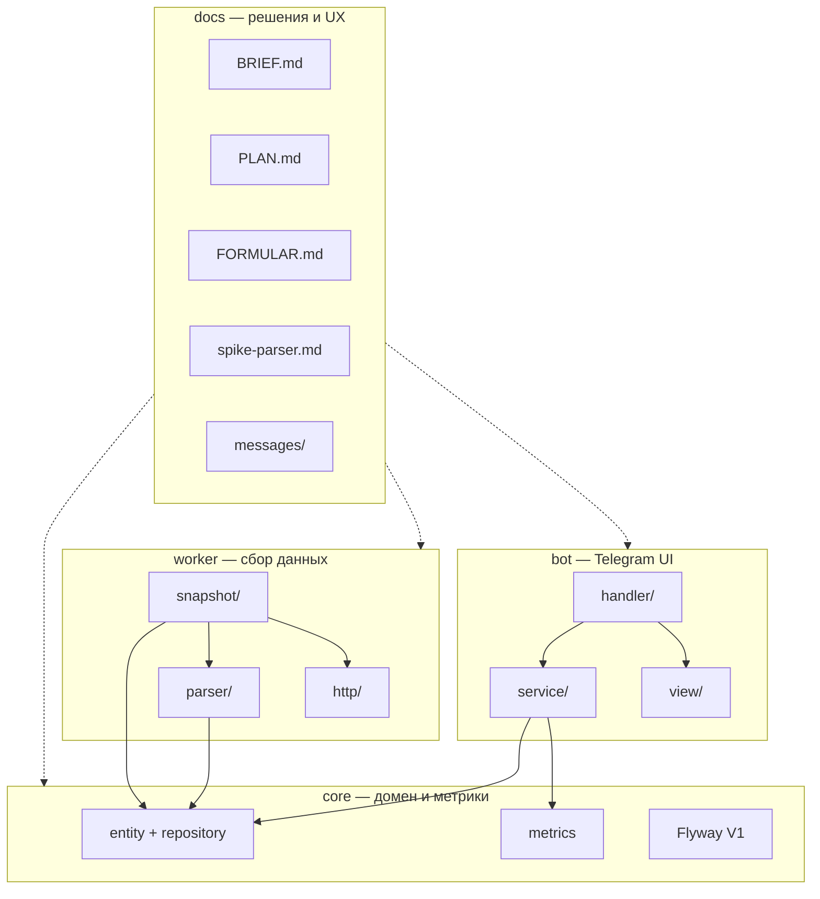

# ROUTING — навигация по проекту для AI-агентов

> **Цель:** не читать весь репозиторий целиком. Сначала определить тип задачи → открыть только нужные зоны.  
> **Точка входа:** [`AGENTS.md`](../AGENTS.md) (правила, источник данных, конвенции).  
> **Актуально:** этапы 0–5 завершены; v1: 6 H2H → 7 партнёры → 8 привязка → 9 лайв → 10 VPS. График — v2.

---

## Как пользоваться

1. Прочитай **§ «Минимальный bootstrap»** (ниже) — один раз на сессию.
2. Найди задачу в **§ «Маршрут по типу работы»** или **§ «Маршрут по этапу PLAN»**.
3. Открой только указанные файлы/папки. Остальное — по необходимости через ссылки внутри зоны.
4. При изменении формул/концепции — синхронизируй [`BRIEF.md`](BRIEF.md); при смене контрактов парсера — [`spike-parser.md`](spike-parser.md).

---

## Топология репозитория

```
badminton-lab-tg-bot/
├── AGENTS.md              ← правила для агентов (всегда)
├── dev.ps1 / dev.cmd      ← локальный запуск
├── docker-compose.yml     ← PostgreSQL + pg_trgm
├── pom.xml                ← parent Maven (core, worker, bot)
│
├── docs/                  ← решения, план, формулы, UX-тексты
├── core/                  ← JPA, Flyway, метрики (общая библиотека)
├── worker/                ← парсинг badminton4u + слепок в БД
└── bot/                   ← Telegram long polling
```

**Зависимости модулей:** `bot` → `core` ← `worker`. Парсеры живут в `worker`, но не подтягиваются в `bot`.



---

## Минимальный bootstrap (≈5 файлов)

Читать **перед любой задачей**, если контекст чата пустой:

| Файл | Зачем |
|---|---|
| [`AGENTS.md`](../AGENTS.md) | Правила, источник данных, этика парсинга |
| [`docs/BRIEF.md`](BRIEF.md) §2–§4 | Модель данных, ограничения источника, метрики |
| [`docs/PLAN.md`](PLAN.md) — обзор этапов | Что уже сделано и что следующее |
| [`docs/FORMULAR.md`](FORMULAR.md) — оглавление | Где живут формулы и дефолты (не выдумывать!) |
| Этот файл — нужный маршрут ниже | Сужение области чтения |

---

## Зоны проекта

Каждая зона — самодостаточный «кусок» для типовых доработок.

### Z0 — Документация и продуктовые решения

**Путь:** `docs/` (кроме `docs/messages/` — см. Z9)

| Файл | Когда читать |
|---|---|
| [`BRIEF.md`](BRIEF.md) | Любое изменение концепции, UX-сценариев, источника данных |
| [`PLAN.md`](PLAN.md) | Планирование, оценка scope, DoD этапа |
| [`FORMULAR.md`](FORMULAR.md) | Метрики S/Form/P3, рейтинг пары, константы |
| [`spike-parser.md`](spike-parser.md) | Парсинг, fixtures, external_key, go/no-go по страницам сайта |
| [`schema.sql`](schema.sql) | Черновик/справка по схеме (канон — Flyway в core) |
| [`README.md`](README.md) | Локальный запуск, слепок, команды dev |

**Не читать целиком:** `BRIEF.md` — только нужные §; полный `schema.sql`, если достаточно `V1__init.sql`.

---

### Z1 — Инфраструктура и локальный dev

**Путь:** корень репозитория

| Файл | Когда читать |
|---|---|
| [`dev.ps1`](../dev.ps1) / [`dev.cmd`](../dev.cmd) | Запуск postgres/worker/bot, verify/test |
| [`docker-compose.yml`](../docker-compose.yml) | PostgreSQL, порт 5433, pg_trgm |
| [`.env.example`](../.env.example) | Переменные BOT_TOKEN, DB_*, PARSER_*, SNAPSHOT_* |
| [`pom.xml`](../pom.xml) | Версии Spring Boot, jsoup, telegrambots |

**Типичные задачи:** поднять окружение, добавить env-переменную, починить локальный запуск.

---

### Z2 — Core: схема БД и домен

**Путь:** `core/src/main/java/ru/badmintonlab/core/`

| Подзона | Путь | Содержимое |
|---|---|---|
| Сущности | `entity/` | `Player`, `Tournament`, `Pair`, `Match`, `MatchPlayer`, `Participation`, `RivalSummary`, `PlayerRating*`, `SnapshotMeta` |
| Репозитории | `repository/` | Spring Data JPA + нативный pg_trgm-поиск в `PlayerRepository` |
| Проекции | `repository/projection/` | DTO для bot-запросов: `RivalView`, `H2hMatchView`, `RatingDeltaView`, … |
| Доменные enum | `domain/` | `Discipline`, `TournamentStatus`, `MatchSide`, `PlayerSex`, `PairCompositionType` |
| Конфиг JPA | `config/CoreJpaConfig.java` | `@EntityScan`, `@EnableJpaRepositories`, scan метрик |
| Миграции | `core/src/main/resources/db/migration/` | `V1__init.sql`, `V2__player_sex.sql` |
| Общий конфиг | `core/src/main/resources/application-core.yml` | `badminton-lab.metrics.*` |

**Типичные задачи:** новая колонка/таблица (Flyway V2+), новый запрос к БД, проекция для bot, исправление маппинга entity.

**Соседи:** worker пишет в эти таблицы; bot только читает (кроме будущего lazy H2H-fetch).

**Тесты:** `core/src/test/java/ru/badmintonlab/core/metrics/` — только метрики; интеграции с БД пока нет (см. технический долг в PLAN § «Технический долг»).

---

### Z3 — Core: метрики (S, Form, P3, рейтинг пары)

**Путь:** `core/src/main/java/ru/badmintonlab/core/metrics/`

| Класс | Назначение |
|---|---|
| `PlayabilityIndexService` | Индекс сыгранности S |
| `FormService` | Форма по дельтам |
| `GameAccentService` | Игровой акцент (предпочтение + сильная сторона, MD/WD/XD) |
| `PairRatingService` | Официальный `(A+B)/2`, прогнозный рейтинг пары |
| `PairCompositionService` | Тип пары MD/WD/XD/UNKNOWN по полу двух игроков |
| `ForecastService` | Прогноз P3 (логистика + blend H2H) |
| `MetricMath` | Полураспад, сигмоида |
| `MetricsProperties` | Дефолты из YAML |

**Документация:** [`FORMULAR.md`](FORMULAR.md) — единственный источник формул.

**Типичные задачи:** изменить/откалибровать метрику, подключить метрику в bot (этап 6+), unit-тест на формулу.

**Не трогать без нужды:** `entity/`, `worker/` — метрики **чистые**, без БД.

---

### Z4 — Worker: HTML-парсеры (stateless)

**Путь:** `worker/src/main/java/ru/badmintonlab/parser/`

| Класс | Страница источника |
|---|---|
| `TournamentListParser` | список турниров r77 |
| `TournamentResultsParser` | `/tournaments/{id}` — итоговая таблица |
| `TournamentRegistrationParser` | регистрация пар (SSR / AJAX) |
| `TournamentGamesParser` | `gamesd/?tourID=` — pair-vs-pair |
| `PlayerProfileParser` | `/players/{id}` |
| `PlayerDirectoryParser` | справочник `players/?sex_m/f` (+ AJAX) |
| `PlayerProfileSexEvidenceParser` | участия/разряды из профиля (fallback пола) |
| `RivalSummaryAggregator` | агрегат W/L из списка матчей (in-memory) |
| `support/ParseUtils`, `support/HtmlFixtures` | утилиты и загрузка fixtures |

**DTO парсера:** `parser/model/` — не путать с JPA `core.entity`.

**Fixtures:** `worker/src/test/resources/html/` — эталонный HTML для unit-тестов.

**Документация:** [`spike-parser.md`](spike-parser.md) — контракты, external_key, эталонные URL.

**Типичные задачи:** сайт изменил вёрстку, новое поле в профиле, новый парсер, fixture + тест.

**Команда проверки:** `.\dev test` или `.\mvnw.cmd -pl worker test`.

---

### Z5 — Worker: HTTP и клиент badminton4u

**Путь:** `worker/src/main/java/ru/badmintonlab/worker/http/`

| Класс | Назначение |
|---|---|
| `HttpFetcher` | jsoup GET/POST, retry, User-Agent |
| `RateLimiter` | ≤ maxRps на хост |
| `Badminton4uClient` | URL-фабрика и вызовы страниц |
| `PlayerDirectoryLoader` | справочник пола: SSR + AJAX-пагинация (singles/doubles) |

**Конфиг:** `worker/config/ParserProperties.java`, `worker/src/main/resources/application.yml`

**Типичные задачи:** новый endpoint, AJAX POST, rate-limit, исправление fetch.

**Правило:** вежливый парсинг — см. `AGENTS.md`. Bot имеет свой лёгкий fetch: `bot/config/BotFetchConfig.java`, `bot/service/H2hLazyFetchService.java` (lazy H2H).

---

### Z6 — Worker: pipeline слепка (snapshot)

**Путь:** `worker/src/main/java/ru/badmintonlab/worker/snapshot/`

| Класс | Роль в pipeline |
|---|---|
| `SnapshotService` | Оркестратор: турниры → итоги → gamesd → профили → rival_summary |
| `TournamentUpsertService` | Турниры |
| `ResultUpsertService` | Participation из итогов |
| `PairService` / `PairInserter` | Пары (идемпотентно) |
| `MatchUpsertService` | Матчи из gamesd |
| `PlayerUpsertService` | Профили и рейтинги |
| `PlayerSexSyncService` | Синхронизация пола после слепка |
| `PlayerSexProfileFallbackService` | Fallback пола из SSR-профиля (все регионы) |
| `SexSyncStartupRunner` | Dev-trigger: только sync пола |
| `RivalSummaryRebuildService` | Полная пересборка `rival_summary` из БД |
| `SnapshotSupport` | Маппинг parser DTO → entity |
| `SnapshotScheduler` / `SnapshotStartupRunner` | Cron и dev-trigger |
| `SnapshotMetrics` | Счётчики прогона |

**Конфиг:** `worker/config/SnapshotProperties.java` — регион, годы, дисциплины, `SNAPSHOT_TOURNAMENT_IDS`.

**Типичные задачи:** новый шаг слепка, идемпотентность upsert, точечный re-import, scheduled run.

**Документация:** [`README.md`](README.md) § «Слепок региона», [`PLAN.md`](PLAN.md) этап 2.

---

### Z7 — Bot: маршрутизация и состояние чата

**Путь:** `bot/src/main/java/ru/badmintonlab/bot/handler/`, `bot/session/`

| Класс | Назначение |
|---|---|
| `UpdateDispatcher` | Главный роутер: команды, callback, свободный текст |
| `H2hFlowHandler` | Многошаговый сценарий H2H (этап 6) |
| `ChatSession` / `ChatSessionStore` | Состояние диалога в памяти |
| `BadmintonLabBot` | Spring + long polling entry |

**Типичные задачи:** новый экран/команда, callback-маршрут, FSM-сценарий.

**Тесты:** `bot/src/test/java/ru/badmintonlab/bot/handler/` — диспетчер без Spring.

**Паттерн:** handler возвращает `List<BotApiMethod<?>>` → легко тестировать.

---

### Z8 — Bot: сервисы чтения БД

**Путь:** `bot/src/main/java/ru/badmintonlab/bot/service/`

| Сервис | Экран / функция |
|---|---|
| `PlayerSearchService` / `PlayerSearchOperations` | Поиск pg_trgm |
| `PlayerCardService` / `PlayerCardLoader` | Карточка игрока |
| `PlayerFormService` | Форма 👊 для карточки и H2H |
| `PlayerGameAccentService` | Игровой акцент 🎯/💪 для карточки |
| `RivalService` / `RivalLookup` | Список соперников |
| `H2hService` | H2H: W-L, матчи, метрики, тип пары (этап 6) |
| `H2hLazyFetchService` | Lazy fetch с сайта при нехватке матчей |
| `SnapshotInfoService` | Дата актуальности данных |

**DTO бота:** `bot/model/` — `PlayerCard`, `RivalsPage`, `H2hResult`, …

**Репозитории core:** особенно `PlayerRepository`, `RivalSummaryRepository`, `H2hRepository`, `MatchRepository`.

**Типичные задачи:** новый SQL/JPQL, оптимизация поиска, сбор данных для экрана.

---

### Z9 — Bot: представление (тексты и клавиатуры)

**Путь:** `bot/src/main/java/ru/badmintonlab/bot/view/`, `bot/util/`

| Класс | Назначение |
|---|---|
| `Texts` | HTML-тексты сообщений |
| `Keyboards` | Inline-клавиатуры |
| `CallbackData` | Кодирование callback (лимит 64 байта TG) |
| `DisciplineLabels`, `SearchButtonLabel`, `MessageEmoji` | Форматирование |
| `Names`, `ProfileLinks`, `TournamentResults` | Утилиты отображения |

**Дизайн-доки (согласованный UX):** `docs/messages/` — **читать перед правкой текстов**

| Файл | Экран |
|---|---|
| `00-principles.md` | Сквозные правила |
| `01-start-menu.md` | `/start` |
| `02-search.md` | Поиск |
| `03-player-card.md` | Карточка |
| `04-rivals.md` | Соперники |
| `05-h2h.md` | H2H (этап 6) |
| `06-rating-history.md` | График (**v2**) |
| `07-help.md` | `/help` |
| `08-partner-pick.md` | Партнёры (этап 7) |

**Типичные задачи:** текст кнопки, emoji, новая клавиатура, правка формата карточки.

**Workflow:** правка «Согласованный вид» в `docs/messages/` → перенос в `Texts`/`Keyboards`.

---

## Маршрут по типу работы

Быстрый выбор зон. «+ bootstrap» = § минимальный bootstrap выше.

| Задача | Читать (в порядке) | Модули |
|---|---|---|
| **Новый экран бота / UX** | bootstrap → `docs/messages/XX-*.md` → Z7 → Z9 → Z8 (нужный сервис) | bot, возможно core |
| **Поиск игроков** | Z8 (`PlayerSearch*`) → `PlayerRepository` → `V1__init.sql` (индексы trgm) | bot, core |
| **Карточка / соперники** | `03-player-card.md`, `04-rivals.md` → Z8 → Z2 (`RivalSummary*`) | bot, core |
| **H2H (этап 6)** | `05-h2h.md` → Z7 (`H2hFlowHandler`) → Z8 (`H2h*`) → Z3 (`PairCompositionService`) → `H2hRepository` → Z4 | bot, core, worker |
| **Пол игрока (этап 5)** | `PLAN.md` этап 5 → Z4 (`PlayerDirectoryParser`, `PlayerProfileSexEvidenceParser`) → Z5 (`PlayerDirectoryLoader`) → Z6 → Z2 (`Player` + V2) → Z3 | worker, core |
| **Формула / метрика** | `FORMULAR.md` → Z3 → тесты `core/.../metrics/` | core |
| **Схема БД / миграция** | `BRIEF.md` §2 → Z2 → `schema.sql` (справка) → `V1__init.sql`, `V2__player_sex.sql` | core |
| **Парсер сломался / новое поле** | `spike-parser.md` → Z4 → fixture → тест `worker/.../parser/` | worker |
| **Новая страница сайта** | `spike-parser.md` → Z5 → Z4 (новый parser) → Z6 (включить в pipeline) | worker |
| **Слепок / upsert / rival_summary** | `README.md` §слепок → Z6 → Z2 (entity) → Z4 | worker, core |
| **Rate-limit / HTTP** | Z5 → `ParserProperties` | worker |
| **Lazy fetch из бота** | Z8 (`H2hLazyFetchService`) → Z5 (паттерны) → `BotFetchConfig` | bot, worker (реф.) |
| **Конфиг метрик** | `FORMULAR.md` → `application-core.yml` → `MetricsProperties` | core |
| **Локальный запуск / CI** | Z1 → `README.md` | root |
| **Деплой VPS (этап 10)** | Z1 → `PLAN.md` этап 10 → `docker-compose.yml` | root, все модули |
| **Подбор партнёра (этап 7)** | `08-partner-pick.md` → Z3 → Z2 → Z4 (`TournamentRegistrationParser`) → Z6 | bot, core, worker |
| **Привязка TG (этап 8)** | `PLAN.md` этап 8 → Z7 → Z2 (новая сущность link) → Z8 | bot, core |
| **Лайв MVP (этап 9)** | `PLAN.md` этап 9 → Z7 (FSM) → Z2 (live entities) → Z8 | bot, core |
| **График рейтинга (v2)** | `06-rating-history.md` → Z8 → Z2 (`PlayerRatingHistory`) | bot, core |
| **Технический долг** | `PLAN.md` §«Технический долг» → указанная зона | varies |

---

## Маршрут по этапу PLAN.md

| Этап | Статус | Зоны | Ключевые документы |
|---|---|---|---|
| 0 Spike | ✓ | Z4, fixtures | `spike-parser.md` |
| 1 Каркас | ✓ | Z1, Z2 | `PLAN.md`, `README.md` |
| 2 Worker слепок | ✓ | Z5, Z6, Z4 | `README.md`, `spike-parser.md` |
| 3 Метрики | ✓ | Z3 | `FORMULAR.md` |
| 4 Bot shell | ✓ | Z7, Z8, Z9 | `docs/messages/01–04` |
| **5 Пол игрока** | **✓** | Z4, Z6, Z2, Z3 (`PairCompositionService`) | `PLAN.md` этап 5, `spike-parser.md` §7 |
| **6 H2H** | **→ текущий** | Z7, Z8, Z3, Z2 (`H2hRepository`) | `05-h2h.md`, `FORMULAR.md` §P3 |
| 7 Партнёры | planned | Z8, Z3, Z4, Z6 | `08-partner-pick.md`, `FORMULAR.md` §3 |
| 8 Привязка TG | planned | Z7, Z8, Z2 | `PLAN.md` этап 8, `BRIEF.md` §6.1 |
| 9 Лайв MVP | planned | Z7, Z2, Z8 | `PLAN.md` этап 9, `BRIEF.md` §6.2 |
| 10 VPS | planned | Z1 | `PLAN.md` этап 10 |
| v2+ Roadmap | — | по направлению | график рейтинга, `BRIEF.md` §11 |

---

## Что не читать без необходимости

| Область | Почему |
|---|---|
| Весь `BRIEF.md` (~275 строк) | Достаточно нужного § + `FORMULAR.md` |
| Все 40+ entity/repository файлов | Открывать точечно по таблице из задачи |
| `worker/target/`, `core/target/`, `bot/target/` | Артефакты сборки |
| `.run/*.log` | Локальные логи dev-запуска |
| `worker/src/test/resources/html/live-debug/` | Отладочные дампы, не эталонные fixtures |
| Все unit-тесты модуля | Только тесты **затронутого** класса |
| `mvnw`, wrapper jar | Инфра Maven, не бизнес-логика |
| Модуль `worker` при правке только текстов бота | Bot не зависит от parser-кода |
| Модуль `bot` при правке только парсера | Парсер тестируется fixtures без bot |

---

## Связи «кто от кого зависит»

При изменении зоны проверь соседей:

```
Изменил парсер (Z4)
  → SnapshotSupport / Upsert* (Z6)
  → spike-parser.md + fixture + worker test
  → возможно entity (Z2), если новое поле в БД

Изменил entity / Flyway (Z2)
  → Upsert-сервисы worker (Z6)
  → Repository + projections (Z2)
  → сервисы bot (Z8), если меняется контракт чтения

Изменил метрику (Z3)
  → FORMULAR.md + MetricsProperties
  → H2hService / Forecast (Z8) при показе в UI

Изменил callback / экран (Z7, Z9)
  → UpdateDispatcherTest
  → docs/messages соответствующий экран
```

---

## Команды проверки по зонам

| Зона | Команда |
|---|---|
| Только парсер | `.\dev test` или `.\mvnw.cmd -pl worker test` |
| Core метрики | `.\mvnw.cmd -pl core test` |
| Bot | `.\mvnw.cmd -pl bot test` |
| Весь проект | `.\dev verify` |
| Слепок (ручная) | `.\dev postgres up` → настроить `SNAPSHOT_*` → `.\dev worker start` |

---

## Добавление новой зоны

Если появляется крупный новый пакет (например `bot/chart/` на этапе 7):

1. Добавь строку в § «Зоны проекта» с путём, ключевыми классами и типичными задачами.
2. Добавь маршрут в § «Маршрут по типу работы».
3. Обнови строку этапа в § «Маршрут по этапу PLAN.md».
4. При необходимости — одну строку в [`AGENTS.md`](../AGENTS.md) § «О проекте».

---

*Последнее обновление структуры: 2026-07-22 (этапы 0–4 ✓, H2H в progress).*
